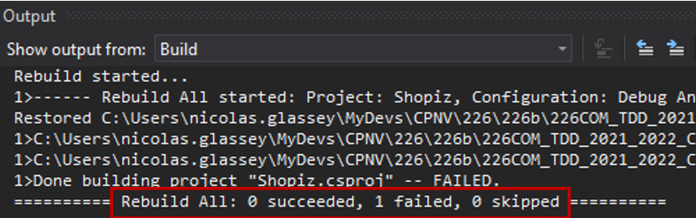
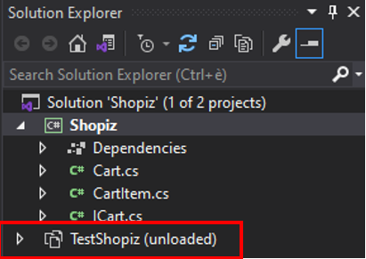
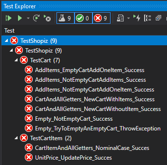

# 226b - Debug Me

---
## Ce projet a pour objectif d'entraîner le debug

Les règles du jeu sont simples :

* vous avez 60 minutes pour faire tourner le projet
* 10 minutes après le lancement du projet, vous obtenez un premier indice
* 20 minutes après, vous obtenez un deuxième indice
* 30 minutes vous obtenez un troisième indice
* ensuite... good luck ;)

---
### Prise en main du projet

1. récupérer le dépôt en local
2. tenter une première compilation

---
### Récupérer le code de départ

1)  Récupérer le dépôt
   
```
    git clone [uri's repo]
```
2)  Tenter de compiler le projet



3)  Observer l'architecture du projet



---
### Résultat à obtenir



**Auteur**

Nicolas Glassey

23-DEC-2021
